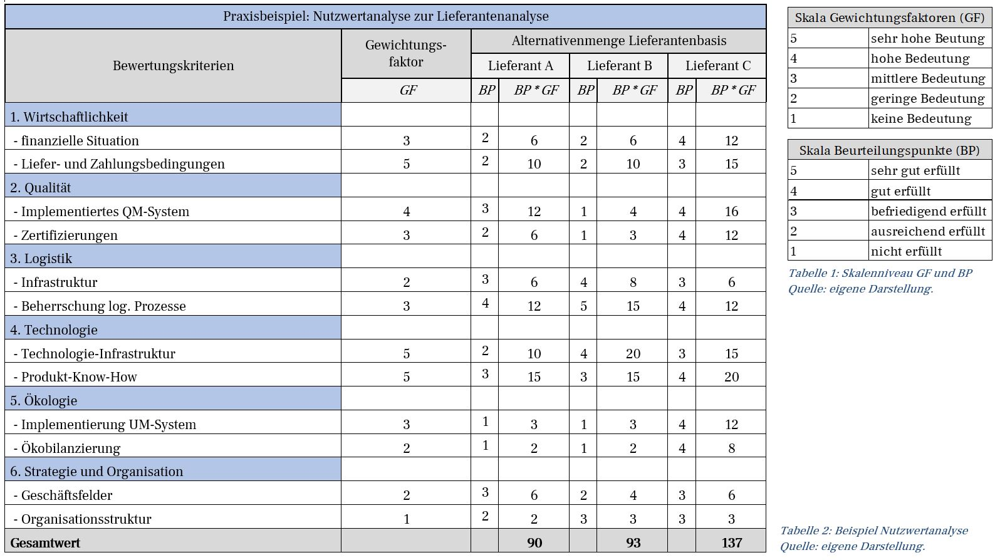

# 1.Einführung 

Maßnahmen gegen die Anforderungen der dynamischen Umwelt, wie der fortschreitende Digitalisierungsprozess, die steigenden Kundenanforderungen sowie der daraus resultierende Wettbewerbsdruck müssen fest in der Unternehmensstrategie verankert sein (Kreitz, 2009, S. 42). Auch bezeichnet als Megatrends, schaffen deren Anforderungen gleichzeitig ein „Window of Opportunity“, sprich neue Gestaltungsmöglichkeiten, für Geschäftsmodelle (Wagner & Kabel, 2018, S. 170).

Nach Bieger (2011, S. 17) besteht ein Geschäftsmodell aus drei Hauptkomponenten: Der Value Proposition, der Architektur der Wertschöpfung und dem Ertragsmodell. Ersteres bezieht sich auf den Nutzen, den Kunden oder Partner aus der Verbindung mit einem Unternehmen ziehen können. Zweiteres beinhaltet eine Beschreibung der Stufen der Wertschöpfung und der wirtschaftlichen Agenten und ihrer Rollen in der Wertschöpfung. Letzteres beschäftigt sich mit zukünftigen Einnahmen, mit dem Wert des Geschäftsmodells und somit mit seiner Nachhaltigkeit (Bieger, 2011, S. 23).

Wird der Fokus auf die externe Seite eines Geschäftsmodells gelegt, stellen insb. Zulieferer in einem Unternehmen ein wichtiges Element der betrieblichen Wertschöpfungskette dar (Schwalbach, 2018, S. 12). Eine hinreichende Lieferantenanalyse ermöglicht es dem Unternehmen, aus einem großen Pool von Lieferanten, den kostengünstigsten sowie qualitätsbesten Partner zu ermitteln (Schwalbach, 2018, S. 12). Im Zuge dessen, greifen Unternehmen auf Hilfsmittel zurück, die die Abwägung von bestehenden Alternativen erleichtert. Als ein bewährtes Hilfsmittel zeigt sich dabei die sog. Nutzwertanalyse, welche anhand von festgelegten Bewertungskriterien eine Präferenzrangfolge für die Auswahlentscheidung vorlegt (Kühnapfel, 2019, S. 2).

Ziel dieser Ausarbeitung ist es, die Lieferantenanalyse sowie die Nutzwertanalyse als entsprechendes Hilfsmittel zu erläutern. Dafür wird in Kapitel zwei die theoretische Fundierung der Lieferantenanalyse dargestellt. Eine Erläuterung der Nutzwertanalyse sowie eine praktische Anwendung erfolgt in Kapitel drei. Ein Fazit in Kapitel vier schließt diese Arbeit ab.

# 2.Prozess der Lieferantenanalyse

Die Aufgaben des Einkaufs haben sich seit den 1950er Jahren von der reinen Bestellabwicklung zum nachhaltigen Wertschöpfungsmanagement entwickelt. Dazu gehört z.B. Lieferantenrisiken frühzeitig zu erkennen, damit Versorgungsengpässe und Imageverluste vermieden werden können (Stollenwerk, 2016, S. 22). Janker unterteilt den Prozess des Lieferantenmanagements bis zur Entscheidung für einen Lieferanten in fünf Schritte (Janker, 2009, S. 57).

[Hier ist mein Bild](https://leonie1505.github.io/)

Dabei wird im Rahmen der Lieferantenidentifikation zunächst überprüft, welche bestehenden oder neuen Lieferanten in Frage kommen. Dazu können sowohl primäre Quellen, wie z.B. die Beauftragung eines Marktforschungsinstituts oder das Einholen von Angeboten, als auch sekundäre Quellen wie z.B. Firmenverzeichnisse oder Werbung genutzt werden (1) (Irlinger, 2012, S. 27). Zur Eingrenzung der zur Verfügung stehenden Lieferanten können dann Lieferantenselbstauskünfte eingeholt oder Zertifizierungen abgefragt werden, sowie anhand von K.O.-Kriterien Lieferanten ausgeschlossen werden (2) (Irlinger, 2012, S. 29–31).

Die eigentliche Lieferantenanalyse umfasst laut Irlinger (2012, S. 31) „die Ermittlung, Aufbereitung, Verarbeitung und Darstellung von Informationen über potenzielle Lieferanten“. Die Methoden zur Lieferantenbewertung lassen sich in quantitative und qualitative Methoden unterteilen. Zu den quantitativen Methoden gehört z.B. die Preis-Entscheidungsanalyse oder die Kosten-Entscheidungsanalyse (Janker, 2009, S. 102). Qualitative Methoden lassen sich unter den Oberbegriffen grafische, verbale oder numerische Darstellung weiter unterteilen. Dabei gehört zu den numerischen Verfahren auch die Nutzwertanalyse (Janker, 2009, S. 125-126).
Im Rahmen dieser Ausarbeitung wird nun der Fokus auf die Lieferantenbewertung mit Hilfe einer Nutzwertanalyse gelegt.

# 3.Lieferantenanalyse mit Hilfe der Nutzwertanalyse

Die Nutzwertanalyse ist die „Analyse einer Menge komplexer Handlungsalternativen mit dem Zweck, die Elemente dieser Menge entsprechend den Präferenzen des Entscheidungsträgers bezüglich eines multidimensionalen Zielsystems zu ordnen. Die Abbildung dieser Ordnung erfolgt durch die Angabe der Nutzwerte (Gesamtwerte) der Alternativen“ (Zangemeister, 2014, S. 45). Die Nutzwertanalyse ist deshalb sinnvoll, wenn es entweder eine hohe Anzahl von Bewertungskriterien gibt oder es sowohl qualitative als auch quantitative Bewertungskriterien gibt (Voigt & Witte, 2011, S.420-421).

Kühnapfel beschreibt die Vorgehensweise bei der Nutzwertanalyse folgendermaßen:

Entsprechend diesem Schema wird nun die Nutzwertanalyse zur Auswahl eines neuen Lieferanten für ein fiktives Unternehmen vorgenommen. 

In diesem Beispiel steht das Projekt „Auswahl eines neuen Lieferanten“ unter der Leitung des Einkaufs. Von der ersten Recherche bis zur ersten Bestellung bei dem neuen Lieferanten ist ein Zeitplan von drei Monaten vorgesehen (1). Im vorliegenden Beispiel handelt es sich um ein Entscheidungsproblem. Es soll im Laufe des Projektes entschieden werden, welcher neue Lieferant ein fester Bestandteil des Wertschöpfungsprozesses des Unternehmens wird (2).  

Im Rahmen einer Vorselektion werden die drei Lieferanten A-C als Partner in Betracht gezogen (Vgl. Tabelle. 1) (3). Bei der Auswahl der Entscheidungskriterien werden die für das Unternehmen wichtigsten Faktoren gesammelt.  Bei der Auswahl der Kriterien sollen die Anforderungen der Vollständigkeit, Bewertbarkeit, Relevanz und Reproduzierbarkeit beachtet werden.  Unter Beachtung dieser Anforderungen werden die Kriterien Wirtschaftlichkeit, Qualität, Logistik, Technologien, Ökologie und Organisation herangezogen. Zur Operationalisierung werden jeweils einzelne Unterpunkte/Items gebildet (Vgl. Tabelle 1) (4).

Zur Gewichtung der gesammelten Entscheidungskriterien, muss entschieden werden, welche Kriterien wichtiger bzw. weniger wichtig für die Auswahl sind (5). Als besonders wichtig werden die Liefer- und Zahlungsbedingungen sowie die technologische Infrastruktur erachtet. Als weniger wichtig werden die Kriterien der Organisation und Geschäftsfelder eingestuft. Die Gewichtungsfaktoren der restlichen Entscheidungskriterien sind Tabelle 1 zu entnehmen.  
An der Bewertung der Lieferanten werden die eingebundenen Fachbereiche beteiligt. Dabei wird festgehalten, dass die Lieferanten anhand einer Skalentabelle von 1 - 5 beurteilt werden, um ein einheitliches Verständnis zu schaffen. 

Die Bewertung für die drei Anbieter kann der nachfolgenden Tabelle entnommen werden: 

Es ist festzuhalten, dass der Lieferant C mit 137 Punkten den deutlich höchsten Gesamtwert aufzeigt.  Etwas abgeschlagen mit 93 Punkten ist der Lieferant B zu beurteilen. Mit einem geringen Abstand liegt Lieferant A mit 90 Punkten auf dem letzten Platz.

Dem Lieferanten A ist nicht nur aufgrund der niedrigsten Punktzahl abzuraten, sondern auch, da dieser bei den besonders hoch gewichteten Bewertungskriterien am geringsten abschneidet. Auf Basis der Nutzwertanalyse kann also der Lieferant C empfohlen werden, da dieser in den an den höchsten gewichteten Bereichen eine hohe Punktzahl erreicht. 

# 4.Fazit

Die Nutzwertanalyse bietet die Möglichkeit, eine objektive Lieferantenanalyse vorzunehmen. Dabei werden Kriterien gewichtet und es wird verhindert, dass ein „gutes Bauchgefühl“ eine schwerwiegende Entscheidung negativ beeinflusst. Eine effiziente Lieferantenanalyse kann mit Hilfe der Nutzwertanalyse daher weitestgehend erfüllt werden. 

Dennoch muss beachtet werden, dass die Bewertung der einzelnen Kriterien, da sie von Individuen vorgenommen wird, subjektiv ausfallen kann. Neben der Nutzwertanalyse gibt es weitere Methoden zur Bewertung von Lieferanten, wie z.B. die Preis-Entscheidungsanalyse. Eine Beurteilung anhand dieser Methode, hätte zu einem anderen Ergebnis führen können, da andere Kriterien berücksichtigt werden. 

# 5.Literaturverzeichnis

Bieger, Thomas (Innovative Geschäftsmodelle, 2011): Innovative Geschäftsmodelle, Berlin, Heidelberg: Springer-Verlag Berlin Heidelberg, 2011

Irlinger, Wolfgang (Kausalmodelle zur Lieferantenbewertung, 2012): Kausalmodelle zur Lieferantenbewertung, Zugl.: Passau, Univ., Diss., 2011, Wiesbaden: Gabler Verlag / Springer Fachmedien Wiesbaden GmbH Wiesbaden, 2012

— (Kausalmodelle zur Lieferantenbewertung, 2012): Kausalmodelle zur Lieferantenbewertung, Zugl.: Passau, Univ., Diss., 2011, Wiesbaden: Gabler Verlag / Springer Fachmedien Wiesbaden GmbH Wiesbaden, 2012

Janker, Christian G. (Multivariate Lieferantenbewertung, 2009): Multivariate Lieferantenbewertung, Wiesbaden: Springer Fachmedien, 2009
— (Multivariate Lieferantenbewertung, 2009): Multivariate Lieferantenbewertung, Wiesbaden: Springer Fachmedien, 2009

Kreitz, Arne (Optimale Organisation der Wertschöpfung internationaler Unternehmen, 2009): Optimale Organisation der Wertschöpfung internationaler Unternehmen: Modellhafte Abbildung und Vergleich organisatorischer Idealtypen, Bd. 14, München: Hampp, 2009

Kühnapfel, Jörg B. (Nutzwertanalysen in Marketing und Vertrieb, 2019): Nutzwertanalysen in Marketing und Vertrieb, 2. Aufl. 2019, Wiesbaden: Springer Fachmedien Wiesbaden, 2019
Mahnicke, Rüdiger (Business travel management, 2013): Business travel management: Praxis-know-how für den Einkäufer, Wiesbaden: Springer Gabler, 2013

Schwalbach, Lutz (Optimierung der Anzahl Lieferanten, 2018): Optimierung der Anzahl Lieferanten: Eine Methode zur Vereinfachung im Lieferantenmanagement, Norderstedt: Books on Demand, 2018

Stollenwerk, Andreas (Wertschöpfungsmanagement im Einkauf, 2016): Wertschöpfungsmanagement im Einkauf: Analysen - Strategien - Methoden - Kennzahlen, 2., aktualisierte und erweiterte Auflage, Wiesbaden: Springer Gabler, 2016

Voigt, F., Witte H. (2011): Kosten-Nutzen-, Kostenwirksamkeits- und Nutzwertanalysen in der Wirtschaftspolitik. In: Wirtschaftsdienst, zuletzt geprüft am 14.10.2019.

Wagner, Harry/Kabel, Stefanie (Hrsg.) (Mobilität 4.0 - neue Geschäftsmodelle für Produkt- und Dienstleistungsinnovationen, 2018): Mobilität 4.0 - neue Geschäftsmodelle für Produkt- und Dienstleistungsinnovationen, Wiesbaden: Springer Gabler, 2018

Zangemeister, Christof (Nutzwertanalyse in der Systemtechnik, 2014): Nutzwertanalyse in der Systemtechnik: Eine Methodik zur multidimensionalen Bewertung und Auswahl von Projektalternativen, Teilw. zugl.: Berlin, Univ., Diss., 1970, 5., erw. Aufl., Norderstedt: Books on Demand, 2014
